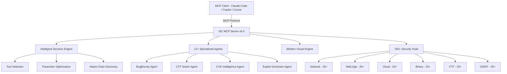

<div align="center">

> **Zero-Trust IP Allowlisting** — All admin operations (scans, audits, infra controls) are locked behind IP allowlisting. Even with valid credentials, requests must originate from the home network. VPN, proxy, and foreign IPs are rejected. IPv6 prefix matching requires a minimum /64 specificity to prevent broad-prefix bypass.

# SIC — Security Intelligence Center

### Penetration Testing MCP Framework for Authorized Security Testing

[](https://www.python.org/)
[](LICENSE)
[](#mcp-integration)
[](#)
[](#security-tools-arsenal)
[](#agents)

**A penetration testing MCP framework with 150+ security tools and 12+ specialized agents for authorized security testing, CTF challenges, and defensive research.**

[SIC Engine](#sic-engine) | [Quick Start](#quick-start) | [API Reference](#api-reference)

</div>

---

## Overview

SIC runs as a local server, exposing a Flask REST API and MCP interface for integration with any MCP-compatible client (Claude Code, Copilot, Cursor). All operations are IP-allowlisted to the home network — unauthorized IPs are rejected at the application layer regardless of credentials.

---

## Architecture

### How It Works

```
MCP Client (Claude Code / Copilot / Cursor)
  │
  ▼ (MCP Protocol)
hexstrike_mcp.py  (FastMCP server)
  │
  ▼ (HTTP — loopback only)
hexstrike_server.py  (Flask REST API — 127.0.0.1:9888)
  │  ├─ Intelligent decision engine
  │  ├─ Tool selection & parameter optimization
  │  ├─ Scope enforcer (scope_enforcer.py)
  │  ├─ Auth & IP allowlist (auth.py)
  │  └─ 150+ security tools (installed on host)
  │
  ├─ billing_server.py  (Flask — :9015, X-Billing-Key auth)
  └─ hexstrike_launcher.py  (CLI entry point)
```

### Application-Layer Security Controls

| Control | Implementation | Purpose |
|---------|---------------|---------|
| IP allowlisting | `auth.py` — home network CIDR check | Blocks all external IPs regardless of credentials |
| Scope enforcement | `scope_enforcer.py` — ALLOWED_TARGETS | Whitelist-only target scanning |
| Loopback binding | `127.0.0.1:9888` | API never reachable from network |
| IPv6 prefix | min `/64` specificity | Prevents broad-prefix bypass |
| Audit log | `audit_log.py` | All operations logged with actor + timestamp |
| Billing quota | `billing_server.py` | Per-tool, per-session request budgets |

---

## SIC Engine

MCP framework with tool orchestration, agent dispatch, and visual output. Connects to Claude Code, Copilot, Cursor, or any MCP-compatible client.

### Architecture



### How It Works

1. MCP client sends commands via MCP protocol
2. Decision engine selects optimal tools and parameters
3. Security tools execute scans, exploits, and analysis
4. Results formatted and returned through MCP with visual output

### Agents

| Agent | Capability |
|-------|-----------|
| **BugBounty Agent** | Automated bug bounty hunting workflow |
| **CTF Solver Agent** | Challenge analysis and solution strategies |
| **CVE Intelligence Agent** | CVE lookup, exploitability analysis, patch tracking |
| **Exploit Generator Agent** | Proof-of-concept exploit development |
| **Recon Agent** | Automated reconnaissance and asset discovery |
| **Web Scanner Agent** | Comprehensive web application assessment |
| **Cloud Auditor Agent** | Multi-cloud security posture review |
| **Network Agent** | Internal/external network penetration testing |
| **Forensics Agent** | Digital forensics and incident response |
| **OSINT Agent** | Open-source intelligence gathering |
| **Social Engineering Agent** | Phishing simulation and awareness |
| **Report Generator Agent** | Automated pentest report creation |

### Security Tools Arsenal

<details>
<summary><strong>Network Security (25+ tools)</strong></summary>

nmap, masscan, rustscan, netcat, tcpdump, wireshark-cli, arp-scan, ping sweep, traceroute, DNS zone transfer, subdomain enumeration, and more.
</details>

<details>
<summary><strong>Web Application Security (40+ tools)</strong></summary>

sqlmap, nikto, wfuzz, gobuster, feroxbuster, httpx, nuclei, XSS detection, SSRF scanner, CORS checker, directory brute-forcing, and more.
</details>

<details>
<summary><strong>Cloud Security (20+ tools)</strong></summary>

ScoutSuite, Prowler, CloudSploit, S3 bucket scanner, IAM analyzer, container security scanning, and more.
</details>

<details>
<summary><strong>Binary Analysis (25+ tools)</strong></summary>

GDB, Radare2, Ghidra, Binwalk, checksec, ROPgadget, pwntools, and more.
</details>

<details>
<summary><strong>CTF Tools (20+ tools)</strong></summary>

CyberChef, John the Ripper, Hashcat, Stegsolve, memory/disk forensics toolkit, and more.
</details>

<details>
<summary><strong>OSINT (20+ tools)</strong></summary>

theHarvester, Shodan, SpiderFoot, Recon-ng, Maltego, and more.
</details>

---

## Quick Start

```bash
# Start the full server (MCP + REST API)
python hexstrike_server.py

# MCP-only mode (for Claude Code / Cursor integration)
python hexstrike_mcp.py

# CLI launcher
python hexstrike_launcher.py

# Standalone billing server (managed by PM2 on :9015)
python billing_server.py

# Verify health
curl http://127.0.0.1:9888/health
```

Add to your MCP client config:

```json
{
  "mcpServers": {
    "sic": {
      "command": "python",
      "args": ["path/to/hexstrike_mcp.py"]
    }
  }
}
```

## Recent Additions

- Standalone billing server with machine-to-machine API key auth (`X-Billing-Key`)
- Sentry SDK integrated into HexStrike server for error tracking
- Login page: large centered clickable logo, background cycles on click
- Settings panel hidden behind logo-toggle control bar
- Letter Glitch background added as 3rd theme option (alongside galaxy + navy)
- Logo upload + background toggle — customize dashboard appearance
- Published `npx sic-security@beta` for quick install

## Run with npx

```bash
npx sic-security@beta
```

## Authorized Use Only

> SIC is designed exclusively for authorized security testing. All operations must target systems you own or have explicit written permission to test. The IP allowlist enforces this at the application layer — requests from unauthorized IPs are blocked regardless of credentials.
